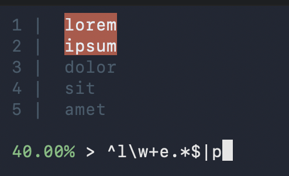

# `vgrep`: Visual Global Regex Print



---

## Installation

### Option 1 — Go install

```bash
go install github.com/bjluckow/vgrep@latest
```

Make sure `$GOPATH/bin` or `$HOME/go/bin` is in your PATH.

### Option 2 — build locally

```bash
git clone https://github.com/bjluckow/vgrep
cd vgrep
go build
```

Then move the binary somewhere in your PATH:

```bash
mv vgrep ~/.local/bin/
```

---

## Usage

Pipe input:

```bash
cat file.txt | vgrep
```

Or pass a file:

```bash
vgrep file.txt
```

Type a regex. Matches update live.

Press **Enter** to emit matching lines to stdout.

Press **Esc** or **Ctrl+C** to cancel.

---

## Flags

```
-d    dual column mode (unmatched / matched split view)
```

You can pass raw grep flags after `--`:

```bash
vgrep -d -- -i
```

---

## Controls

```
↑ ↓      scroll
PgUp/PgDn
Home/End
Enter    commit matches
Esc      cancel
```

---

